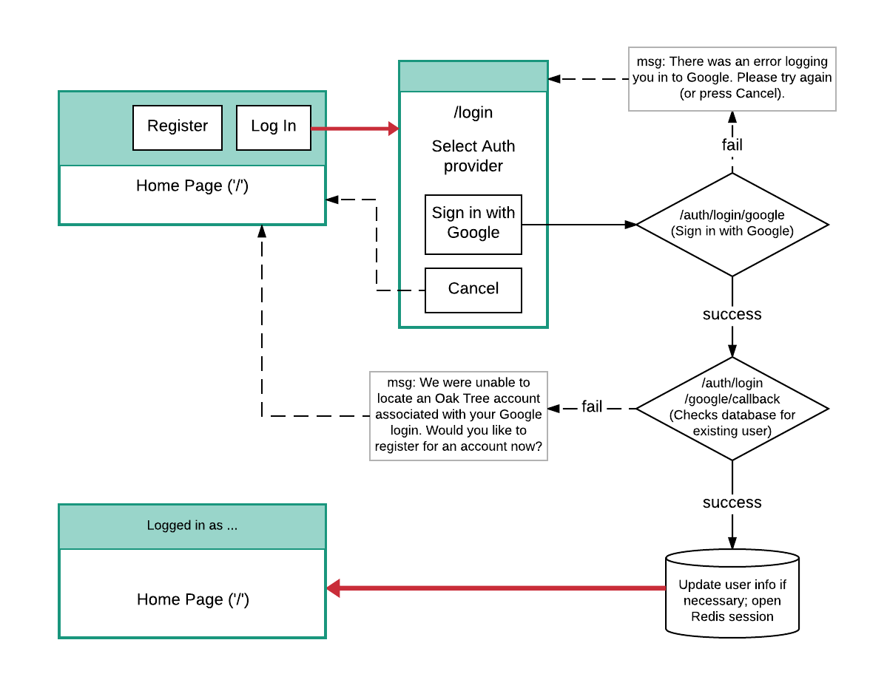
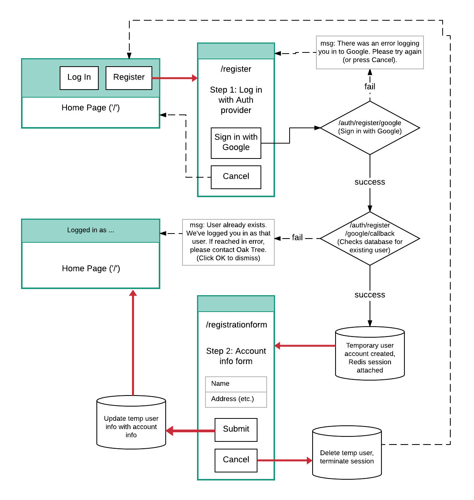

# inspection-reporter

Oak Tree Inspection Manager is a document manager for real estate agents, sellers, and inspectors.

The app has a server side that routes third-party SSO user authentication, registers new user accounts, and maintains user and data databases. It also serves the client-side web app interface. The app is built to be deployed to [Heroku](https://www.heroku.com).

### Client-Side Technologies
* React.js
* React Router (DOM)
* Semantic-UI

### Server-Side Technologies
* Node.js
* Express
* Passport (session/cookie mgmt, OAuth2)
* Redis (session storage)
* Sequelize (PostgreSQL)


## Development Environment

This app was generated with and around Facebook's [create-react-app](https://github.com/facebookincubator/create-react-app). The major advantage to this tool is "hot reloading"--the ability to run a development server in the background, while you develop, so that every time you save files in the code editor, changes are immediately reflected in your open browser. This works extraordinarily well for programming stand-alone websites that do not access external resources. Things get a little more complicated for websites that contact external API and/or authorization providers, but I've become convinced that it's still worth the extra effort to use create-react-app in the client-server React app development environment.

NOTE: You will **not** need to install create-react-app to develop this project. It is only required to initiate the project, which I've already done.

### Basic project structure

The overall project encompasses a parent project, and an embedded front-end-only (create-react-app) child project, all contained within a single git repository. The overall project folder structure looks like this:

```
inspection-reporter-2/
    server.js (entry)
    package.json (for parent project)
    .gitignore
    .env
    .env.*versions*
    README.md (this document)

    client/
        package.json (for child project)
        README.md (create-react-app docs)
        src/
            index.js (React project entry)
            components/
            images/

    server/
```
Even though there is a .gitignore file in the client child project, there is no git repo in the child folder; all commits should be made in the parent directory. In addition, the package.json file in the client directory is for front-end packages (like Semantic-UI) and transpile-time dependencies only.

### Local installations

In order to develop locally, you will need a couple of services active on your local machine. First, you will need PostgresSQL running, listening on port 5432 (the default for postgres). You will also need a database called `inspection-reporter`. The program will create a table named `users` when run for the first time. You should change the enviroment variable `DB_USERNAME` in `.env` and `.env.development` to whatever your postgres DB username is. In addition, if your database name or connection settings are different from the defaults, you will need to configure the appropriate environment variables in `.env` and `.env.development`.

You will also need Redis running locally, and listening on port 6379 without a password requirement. (This is for local development only; in production, the Redis session store will be password protected by Heroku.)

### Development, staging, and production environments

The project is designed to run in three different programming environments. Much of the instructions for how to do this are available in David Ceddia's articles "[Create React App with an Express Backend](https://daveceddia.com/create-react-app-express-backend/)", "[Create React App with Express in Production](https://daveceddia.com/create-react-app-express-production/)", and the create-react-app docs on [manual proxy configuration](https://github.com/facebookincubator/create-react-app/blob/master/packages/react-scripts/template/README.md#configuring-the-proxy-manually).

#### Development

The project supports continuous front-end development with hot reloading, via a Webpack development server. However, in order for this to work, you will actually need to run two servers at the same time: the Webpack server, and the parent project Node.js server. To do this:

* Copy the contents of .env.development into .env. This will result in the parent project loading dev-environment variables into process.env upon start.

* Open one Terminal window in the parent project directory, and `yarn start` to start the Node.js server. It should report that the server is listening on localhost:5000.

* Open a second Terminal window in the client project directory. Use `npm install` or `yarn` to install client dependencies, including `react-scripts`--React's development bundle that automates Webpack, Babel, and other dev tools. 

* Still in the client directory Terminal, `yarn start` to start the Webpack dev server. The server will transpile code in client/src and serve it at http://localhost:3000. (It should automatically open a browser tab and navigate there.)

"But wait," you might ask, "how do webpages at http://localhost:3000 make requests to localhost:5000? Doesn't that require cross-origin (CORS) permissions?" Luckily for us, the Webpack server provides a proxy server for exactly this purpose. It is set up with a "proxy": config object in the child package.json. I write about this because, if we add any http.get or .post routes from the front- to the back-end, we need to remember to include those routes in the child package.json proxy config object.

#### Staging

The project can be tested in its build configuration by building the client side code locally. This will create a client/build directory, from which static front-end assets will be served. To do this:

* Create and switch to a new, temporary `build` branch in the git project with `git checkout -b build`.

* Copy the contents of .env.staging into .env.

* Navigate a Terminal prompt to the client directory, and `yarn build`.

* Navigate Terminal to the parent directory, and `yarn start`. The server should report that it is listening on localhost:5000.

* Open a browser to http://localhost:5000. All resources are available from this one address.

You do not need to commit this `build` branch in git; it is temporary, meant to verify that the project is ready for deployment. In addition, if there are problems detected, they need to be corrected in the development environment. Once you've confirmed that the build process works, switch branches, and `git branch -d build` to remove the build branch. (This way, if you want to stage again later, you can create a new `build` branch that has no memory of the old one.)

#### Production

Deployment to Heroku requires installing the Heroku CLI, globally (`npm install -g heroku-cli`). Once the project is ready, perform the following steps:

* Make sure any necessary `git merge`s have been completed on the `master` branch of the git project, and that `master` is committed and up-to-date.

* If you haven't already created the heroku project yet, in Terminal in the parent directory, `heroku create`. Make sure shell has reported both the heroku web address where the project will be visible, and the git remote (named "`heroku`") that you will be pushing code to.

* Still in Terminal, `git push heroku master` to deploy. This will not only mirror the repo, it will also initiate `npm install` and `npm start` on the heroku server. Watch Terminal and the Heroku Dashboard for error messages.

* Navigate your browser to the appropriate address at herokuapp.com.


Once we have the production site working, we'll need to associate one of Masoud's DNS names to it.


## Log-in routing guide

#### Log-in
<p align="center">
  
</p>

#### Register
<p align="center">
  
</p>